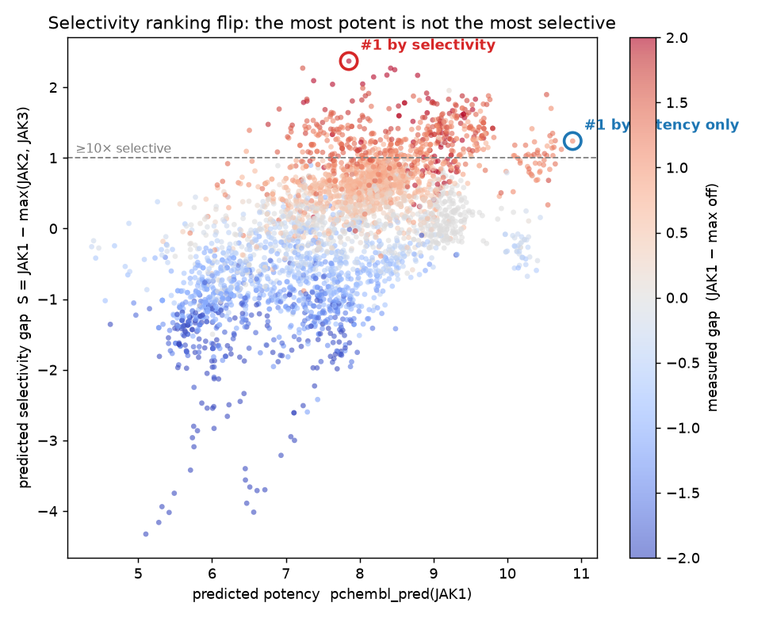
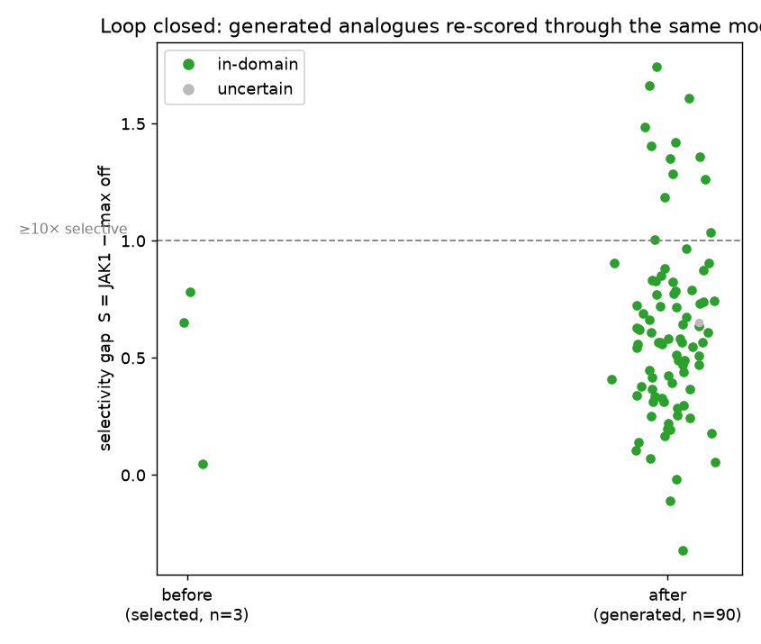
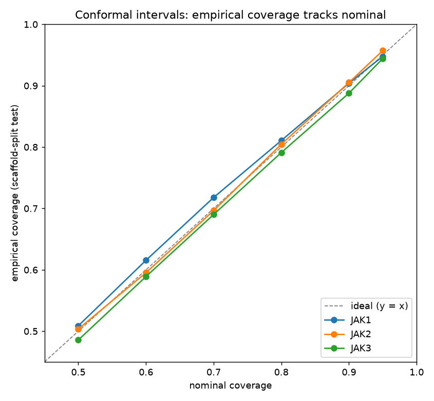
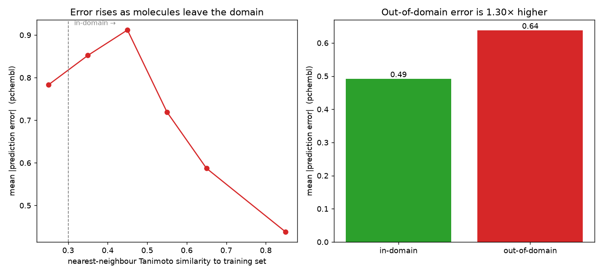

# chem-predict-dashboard

[](https://colab.research.google.com/github/zqvo04/chem-predict-dashboard/blob/main/notebooks/deep_dive.ipynb)

This badge opens the deep-dive notebook at `main`. The **dashboard's own Colab
button** ([Mode 2](#mode-2-selectivity-funnel)) is the one to use for real work: it
is built from the exported contract's `code_version`, so the notebook — and the
clone it makes — land on the exact commit the case was screened at.

The dashboard has **three independent modes**, selectable from the sidebar:

| Mode | What it does |
|------|-------------|
| **Selectivity funnel** | Screens a diverse ~38.6k-molecule library across JAK1/2/3, ranks by isoform selectivity with calibrated uncertainty, applicability-domain verdicts and property (MPO) annotations, lets you pick survivors, and hands them off to an offline deep dive. |
| **Single molecule** | The same Tier-1+2 scoring for one compound entered as a SMILES **or by name**, reported against the library distribution (~1.7 s from a cold process). |
| **Campaigns** | Points the same cascade at a different **selectivity panel** (target + off-targets). Shows what backs the panel — cross-measured data, models, a leakage check — and a **validation tier** badge, then screens it and records the round. |

All three run CPU-only, and all three now run through the same trust layer
(standardisation, binder gate, applicability domain, conformal intervals). The JAK
funnel is the primary deliverable and the only `validated` campaign; any other panel
is `bootstrap` — same tables, explicitly badged as a hypothesis — until its gates
have been re-run.

**Every SMILES entering any mode is reduced to its neutral parent**
(`src/standardize.py`): counterions are stripped and charges neutralised before
anything is featurised. Without this, PubChem's salt form of a marketed drug
(ruxolitinib *phosphate*) carries a counterion into the fingerprint, the Ro5
molecular weight and the applicability-domain distance — and a known JAK inhibitor
comes back "out of domain". Tautomer canonicalisation is deliberately **off**: it
would rewrite 9.7 % of the JAK1 training set and 18.4 % of the library (measured),
which is a retraining decision, not input cleaning.

---

## Three modes — workflow pipelines

### Mode 1: Campaigns

**Entry point:** pick a registered **selectivity panel** in the sidebar and press
*Open campaign*.

A campaign is a panel (a target plus the off-targets it must be selective against),
a library, the models screening it, and the evidence saying how far to trust the
result. It is the entry point for pointing the funnel at chemistry other than JAK.

```
  [user input: which panel]
          │
  Campaign               src/campaign.py  build()
  ─ panel spec (target + off-targets + ChEMBL ids)   src/panels.py
  ─ cross-measured count → validation tier
  ─ model ids, read only if the models already exist
          │
  Leakage check          src/panels.py  disjointness_report()
  ─ no panel member in the binder gate's negative basket
  ─ no panel member in the wide library's target list
    (STEP 10 / STEP 13's lesson, enforced rather than remembered)
          │
  Validation tier        badge + the sentence explaining it
  ─ validated          gates re-run and written up in VALIDATION.md
  ─ bootstrap          models built, gates not re-run — ranking is a hypothesis
  ─ insufficient_data  too little cross-measured data to calibrate a gap
                       interval → the campaign is refused a selectivity claim
          │
  Round history          src/registry.py — data/registry/<campaign>/rounds.jsonl
          │
  The same Tier 0 → 0.5 → 1 → 2 cascade as Mode 2, for this panel
```

Registered panels: **JAK1 vs JAK2/JAK3** (`validated`) and **PI3Kδ vs α/β/γ**
(`bootstrap`). The JAK panel ships pre-trained; PI3K ships its ChEMBL datasets so
the campaign card is honest offline, but trains its models on first run.

**Honest limits of this mode:**
- A `bootstrap` campaign has *not* had its gap-vs-measured-gap ranking, conformal
  coverage or AD separation measured. The badge says so and the ranking should be
  read as a hypothesis.
- Adding a panel means adding a `PanelSpec`; the app does not accept arbitrary
  targets typed at runtime, because a panel needs a deliberate off-target choice
  and a leakage check, not a text box.
- Cold-building a new panel is minutes, not seconds (measured for PI3K: ~230 s
  fetch, ~470 s regressors, ~565 s negatives + gate).

> **This replaced the v1 target screen.** Mode 1 used to be a single-target ChEMBL
> screen ranked by an unvalidated composite score (`0.5·activity + 0.2·QED +
> 0.15·solubility + 0.15·(1 − tox)`), with no uncertainty and no applicability
> domain — the four gaps [DESIGN_DECISIONS §0](DESIGN_DECISIONS.md) says the funnel
> exists to close. It kept one thing worth keeping: it was the only way to point the
> tool at other chemistry. Campaigns keep that and route it through the validated
> cascade. The v1 pipeline itself is unchanged and still runs from its CLI
> (`python -m src.pipeline EGFR --top 15`, [Phase 4](#phase-4--end-to-end-pipeline--composite-scoring)).

---

### Mode 2: Selectivity funnel

**Entry point:** select "Selectivity funnel" in the sidebar; no user input needed —
the library and models are pre-loaded.

```
               ┌─────────────────────────────────────────┐
               │        Stage B — CPU, deployed app       │
               └─────────────────────────────────────────┘

  WIDE LIBRARY  ~38.6k bioactive drug-like, target-agnostic (standardised parents)
  assets/library/library.parquet        src/data/library.py
          │
  Tier 0  Ro5 + PAINS                   near-free          38,594 → 32,322
  ─ precomputed into library cache (property of library + rules only)
  ─ columns druglike/ro5_pass/pains_pass already in the parquet
          │
  Tier 0.5  binder gate → P(JAK binder)   ms/molecule      32,322 → 6,120
  ─ HistGB classifier: JAK actives vs physchem-matched presumed-inactives
  ─ drops molecules the regressors would only score at their training mean
  ─   (ethanol scored a "760 nM" JAK1 pchembl before this existed)
  ─ Youden's-J operating point; ROC-AUC 0.998, keeps 98 % of known actives
  src/models/binder_gate.py   src/data/negatives.py
          │
  Tier 1  per-isoform regressors → gap S   ms/molecule    6,120 → 300
  ─ one HistGB pchembl regressor per isoform on ECFP4
  ─ gap S = pred(JAK1) − max(pred(JAK2), pred(JAK3))
  ─ ranked by S, above a target-potency floor (pred JAK1 ≥ 6)
  src/models/isoform_regressor.py   src/selectivity.py   src/funnel.py
          │
  Tier 2  conformal interval + applicability domain + MPO  300 → 60 (33 in-domain)
  ─ split-conformal 90 % prediction interval per isoform, propagated to gap
  ─ AD: Tanimoto NN to training set  AND  descriptor leverage (hat value)
  ─   both must pass; flagged "uncertain" if either isoform is OOD
  ─ training-side AD check precomputed → assets/ad_reference/*.npz
  ─   (eliminates ~30 s rebuild of 10k training fingerprints per call)
  ─ MPO: QED, predicted logS, Tox21 alert → geometric mean
  src/conformal.py   src/applicability.py   src/mpo.py   src/funnel.py
          │
  Dashboard — shortlist table   app.py  render_funnel()
  ─ columns: gap S, [lo, hi] interval, AD badge, MPO, JAK1 predicted pchembl
  ─ user marks rows → "Export loop contract"
          │
  [SELECT] export loop_contract.json           src/loop_contract.py
  ─ versioned JSON pinning: model_ids, conformal α, code_version
  ─ only artefact that crosses from app to notebook
  ─ "Open in Colab" link built from that same code_version, so the notebook
    Colab opens is the commit the contract came from
  ─ the notebook re-reads code_version out of the uploaded contract and
    checks its clone out at it, so the models are the exported ones too
  ─ app warns when that commit is not pushed — Colab reads GitHub, not disk
  ─ or copy the contract from the paste box and paste it into the notebook:
    web app to Colab in two browser tabs, no file involved

               ┌─────────────────────────────────────────┐
               │    Stage A — offline, Colab notebook     │
               │    notebooks/deep_dive.ipynb             │
               └─────────────────────────────────────────┘

  validate_contract     refuse a file that is not a readable contract
  assert_models_match   refuse if model_ids drifted from the export
  generate_analogues    RDKit aromatic substituent decoration (CPU today;
  ─                     GPU generative model is a documented swap-in)
  ─                     SA-score filtered — an analogue nobody can make is
  ─                     not a testable hypothesis
  score_molecules       the SAME Tier-1+2 modules as Stage B
  ─                     src/deep_dive.py imports src/funnel.score_molecules()
  report_markdown       before/after gap S + AD per analogue
  ─                     "in-silico hypothesis — requires wet-lab validation"

  [docking seam: documented in notebook; src/docking.py does not yet exist]
          │
  A_rescore contract (loop_case_A_rescore.json)
          ▼
  loop closes: analogues re-enter Tier 0 with before/after report
```

**Two separate data sources feed this:**
- **Wide library** (`assets/library/`) — target-agnostic, unlabelled, what gets screened.
  Bioactive drug-like molecules from **20 diverse ChEMBL targets** (ten kinases, ten
  non-kinases), chosen to be **disjoint from everything the binder gate was trained
  on** — no JAK isoform, none of the gate's negative targets, and any molecule in
  either training class dropped by SMILES. So the gate's verdict on a library
  molecule is a prediction, not recall.
- **ChEMBL per-isoform data** (`assets/jak/`, `src/data/jak.py`) — what trains and
  validates the models. Never mixed: the wide screen's `S` is pure prediction,
  trusted only where Tier 2 says in-domain.

> The library was previously the **Tox21 collection**, which was the wrong haystack
> twice over: it is a *toxicology panel* (pesticides, industrial chemicals) rather
> than discovery chemistry, and it was **100 % identical to the toxicity model's own
> training set**, so the MPO tox column was reciting memorised labels. Replacing it
> ([STEP 13](VALIDATION.md#step-13--the-wide-library-was-the-wrong-haystack-2026-07-26))
> cut that overlap to 0.5 %, raised the gate pass rate from 23 to 6 120 molecules,
> and took the shortlist from 4 in-domain to **33**.

**Key design properties:**
- Tier 2 (conformal + AD) runs *only on Tier-1 survivors* (~300 molecules), not the
  full library — that is what makes its per-molecule cost economically real.
- "Re-scored through the same models" is a code fact: Stage A imports `src/funnel`
  directly; `assert_models_match()` rejects any drift.
- **A binder gate (Tier 0.5) carries the non-binder burden**, before the gap is ever
  computed. The regressors are trained only on quantified pchembl, so on an
  off-domain molecule they revert to their training mean (~6.3) — ethanol scored a
  "760 nM" JAK1 pchembl and 83 % of the library cleared the potency floor. A binary
  classifier (JAK actives vs physchem-matched presumed-inactives, ROC-AUC 0.998)
  now drops those first; AD still flags residual out-of-domain survivors, but it no
  longer has to stand in for a non-binder class the regression never saw. See
  [VALIDATION.md STEP 10](VALIDATION.md#step-10--the-binder-gate-tier-05-2026-07-26).
- **Selectivity is not the only thing that disqualifies a molecule.** Tier 2
  annotates each survivor with QED, predicted solubility and a Tox21 alert,
  combined as a **geometric mean** rather than a weighted sum, so one unacceptable
  property drives the score to zero instead of being averaged away. It does *not*
  reorder the shortlist — the ranking stays on gap `S`, and MPO reads as a veto.
  This is visible in the current output: the top two molecules by gap score
  MPO 0.01 (Tox21 alert ≈ 0.9), while the best in-domain candidate scores 0.70.

### Mode 3: Single molecule

Same scoring core, one compound. Entered as a SMILES (parsed locally) or a name
(`src/data/pubchem_client.resolve_name`, PubChem lookup). Both paths go through
`standardize()`, so `ruxolitinib phosphate` and `ruxolitinib` score as the same
structure.

The output **leads with the library percentile, not the gap value** — a deliberate
choice. The 90 % gap interval spans ~±2 pchembl and usually crosses zero, so a
per-molecule selectivity claim is not supported; what *was* validated is the
ranking (Spearman 0.80 against measured gaps, 4.5× enrichment — with the
[assay caveat](#the-headline-selectivity-number-has-a-measured-caveat)). The page says so
explicitly whenever the interval crosses zero, and it flags a molecule whose
Tanimoto nearest neighbour is 1.000 as **in the training set** — those numbers are
a fit, not a forecast, and scaffold-split metrics do not describe them.

Full data-flow schemas and module map: [WORKFLOW.md](WORKFLOW.md).
Design rationale and rejected alternatives: [DESIGN_DECISIONS.md](DESIGN_DECISIONS.md).

## Headline results — all measured, reproducible via `./scripts/reproduce.sh`

Every number has a seed + script; nothing is a placeholder. Full detail and
"where this fails" in [VALIDATION.md](VALIDATION.md).

| Stage | Claim | Result (5-seed scaffold split) |
|------|-------|--------|
| Per-isoform QSAR | pchembl regression, JAK1/2/3 | R² 0.71–0.77, Spearman 0.82–0.88 |
| **Binder gate** | JAK binder vs presumed-inactive | **ROC-AUC 0.998**; ethanol/pesticide gated out, JAK inhibitors kept ([STEP 10](VALIDATION.md#step-10--the-binder-gate-tier-05-2026-07-26)) |
| **Selectivity** | predicted gap vs **measured** gap | **Spearman 0.80**, ≥10×-selective enrichment **4.5×** — but see the [assay audit](#the-headline-selectivity-number-has-a-measured-caveat) |
| Uncertainty | conformal 90% intervals, per isoform | empirical coverage **0.89–0.91** |
| **Selectivity interval** | the gap's own 90% interval | marginal **0.896**, worst-similarity bucket **0.889** (was 0.460 flat / 4.86-wide summed) — [STEP 14](VALIDATION.md#step-14--the-gap-interval-was-calibrated-on-the-wrong-thing-2026-07-27) |
| Applicability domain | error out- vs in-domain | error rises **~2×** as molecules leave the domain |
| **The loop** | one worked case B→SELECT→A→re-score | best in-domain analogue **+2.38** gap (parent +1.68) |

### The headline selectivity number has a measured caveat

Two audits re-tested the selectivity claim against questions it had never been
asked (`scripts/assay_time_audit.py`, full detail in
[VALIDATION.md](VALIDATION.md#audit--assay-type-confound-and-time-split-validation-2026-07-26)).
One result confirms the claim; the other qualifies it, and the qualification is
stated here rather than buried because it changes how the number should be read.

**It survives a time split.** Training only on chemistry published before a cutoff
and testing on what came after — strictly harder than a scaffold split — costs
about a tenth of the rank correlation at comparable training size (Spearman
**0.715 vs 0.798**), and the top-decile enrichment reaches **90 % of its achievable
ceiling vs 73 %** for the scaffold split. The ranking transfers to genuinely
unpublished molecules.

**Part of it is carried by assay conditions, not biology.** The training label
pools IC50, Ki, Kd and EC50. An IC50 for an ATP-competitive kinase inhibitor
depends on the assay's ATP concentration and JAK1/2/3 do not share an ATP Km, so a
gap assembled across assay types can encode an artefact. On the ATP-independent
Ki/Kd-only subset, **at matched sample size**, Spearman falls from **0.682 to
0.462** and the top-decile enrichment collapses from 3.71× to below random. Sample
size explains part of the total drop; it does not explain that.

So "Spearman 0.80" is correctly measured for what it measures, and the honest
phrasing is **"0.80 on pooled assay types, substantially lower on the
ATP-independent subset"**. The Ki/Kd set is small (n = 386) and differs in base
rate, so this is a serious flag requiring follow-up rather than a refutation —
separating the two would need a larger ATP-independent set than ChEMBL supplies, or
explicit ATP normalisation of the IC50 records.

One concern was measured and **dismissed**: 95–99 % of these records are binding
assays, so biochemical-vs-cellular mixing is not a confound here.

| Selectivity ranking flip (hero) | The loop closed |
|---|---|
|  |  |
| Conformal coverage | Applicability domain (money plot) |
|  |  |

## Quickstart

```bash
pip install -r requirements.txt
streamlit run app.py                 # dashboard: funnel / single molecule / target screen
python -m src.funnel                 # CLI: screen the wide library to a shortlist
python scripts/run_loop.py           # run one full B->SELECT->A->re-score case
./scripts/reproduce.sh               # regenerate every headline number + figure
```

Score one molecule without the dashboard:

```python
from src.data.pubchem_client import resolve_name
from src.funnel import gap_percentile, score_molecules

smiles, cid, title = resolve_name("ruxolitinib")     # or pass a SMILES directly
row = score_molecules([smiles]).iloc[0]
print(row["gap"], row["gap_lo"], row["gap_hi"], row["verdict"], row["mpo"])
print(f"{gap_percentile(row['gap']):.1f}th percentile of the library")
```

The Stage-A deep dive runs in [`notebooks/deep_dive.ipynb`](notebooks/deep_dive.ipynb)
— [open it in Colab](https://colab.research.google.com/github/zqvo04/chem-predict-dashboard/blob/main/notebooks/deep_dive.ipynb),
upload a contract in the first cell, and it checks its own clone out at that
contract's commit before re-scoring. One worked case is committed under
[`examples/`](examples/); `python scripts/run_loop.py` runs the same thing locally.

## Deploying

The funnel's cost is in *training*, not screening. So the trained artifacts ship
with the repo under `assets/` — three isoform regressors, the per-isoform ChEMBL
datasets, the wide library, the conformal half-widths and the applicability
reference (~6.6 MB total):

| Path | What |
|------|------|
| `assets/models/jak/*_reg.pkl` | the three deployed isoform regressors |
| `assets/models/jak/binder_gate.pkl` | the Tier-0.5 binder gate + its Youden's-J threshold |
| `assets/jak/*.parquet` | per-isoform datasets + the cross-measured join |
| `assets/jak/negatives.parquet` | the physchem-matched presumed-inactives (binder-gate negatives) |
| `assets/library/library.parquet` | the wide screening library, with its Tier-0 verdict |
| `assets/jak/conformal_quantiles.json` | calibrated 90 % half-widths per isoform + the gap calibration (`q` and the σ knots) |
| `assets/jak/gap_distribution.npz` | the gap-percentile reference, guarded by a model-id provenance string |
| `assets/ad_reference/jak/*.npz` | per-isoform applicability reference (training fingerprints + leverage constants) |

Everything a panel owns is namespaced under its name (`assets/<panel>/`,
`assets/models/<panel>/`, `assets/ad_reference/<panel>/`), so a second panel cannot
load or overwrite the first one's artifacts. The library is deliberately outside
that namespace: it is target-agnostic and shared by every campaign.

Every loader checks the runtime cache in `data/` first and falls back to `assets/`,
so a local rebuild still wins while a fresh deploy retrains nothing. Measured on a
clean checkout with no `data/` directory at all:

| | cold run | peak RSS |
|---|---|---|
| training from scratch | 15–30 min | ~870 MB |
| **from bundled assets** | **~4.5 s** | **~417 MB** |
| **one molecule, cold process** | **~1.7 s** | — |

Same output either way (60-molecule shortlist, 33 in-domain).

Two of those artifacts exist only to keep the screen cheap, and neither can change
a result: **Tier 0** (Ro5 + PAINS) is a property of the library and the filter rules
alone, and the **applicability reference** is the training-side half of the AD check
— the training fingerprints and the leverage standardisation. Recomputing them from
SMILES on every cold start cost 16 s and ~30 s respectively, the latter charged
again on *every* call, so scoring a single molecule cost as much as scoring three
hundred. Precomputed, one molecule now scores in **0.3 s** from a cold process.

**Streamlit Community Cloud** — push and point it at `app.py`; `packages.txt`
supplies the RDKit drawing libraries. The bundled assets are what keep the free
tier from throttling the app for CPU overuse.

**Render / any Docker host** — [`render.yaml`](render.yaml) is a Render blueprint
using [`Dockerfile`](Dockerfile). Locally:

```bash
docker build --build-arg GIT_COMMIT=$(git rev-parse --short HEAD) -t chem-predict .
docker run -p 8501:8501 chem-predict
```

### Keeping the Colab handoff alive on the web

That `--build-arg` is not cosmetic. The export panel builds its Colab link from
the running code's commit, and the notebook checks its clone out at that same
commit — but a deployed container has neither a git binary nor a `.git`
directory, so without help the commit reads `unknown` and the handoff disappears
on the web, which is where most people meet the funnel. There is deliberately
**no fallback to a branch name**: a contract that cannot name its commit cannot
be pinned, and a deep dive that silently ran against a different `main` is the
failure the contract exists to prevent.

`src/loop_contract.py` reads two env-var pairs, the explicit one first:

| Var | Set by |
|-----|--------|
| `CHEM_PREDICT_COMMIT` / `CHEM_PREDICT_REPO` | you — the `Dockerfile` bakes these in from `GIT_COMMIT` |
| `RENDER_GIT_COMMIT` / `RENDER_GIT_REPO_SLUG` | Render, automatically — nothing to configure |

Streamlit Community Cloud deploys from a git clone and needs neither. Whatever
the host, **the deployed commit must be pushed to GitHub** — Colab reads both the
notebook and the clone from there — and the app says so when it is not.

Regenerating the bundle after a data or model change:

Every command takes a panel name (default `jak`), so the same sequence bootstraps
any registered panel:

```bash
python -m src.data.panel_data jak      # refresh datasets  -> data/jak/
python -m src.data.library             # refresh library   -> data/library/  (incl. Tier 0)
python -m src.models.isoform_regressor jak # retrain isoforms -> data/models/jak/
python -m src.data.negatives jak       # rebuild the binder-gate negatives -> data/jak/negatives.parquet
python -m src.models.binder_gate jak   # retrain the gate  -> data/models/jak/binder_gate.pkl
python -c "from src.applicability import load_reference as r; from src.panels import JAK; \
           [r(JAK, i, use_cache=False) for i in JAK.isoforms]"        # -> data/ad_reference/jak/
cp data/jak/*.parquet assets/jak/ && cp data/library/*.parquet assets/library/
cp data/models/jak/*.pkl assets/models/jak/
cp data/ad_reference/jak/*.npz assets/ad_reference/jak/
```

The binder gate must be retrained whenever `assets/jak/*.parquet` or the negative
set changes — its positives are the JAK actives and its negatives are
`negatives.parquet`. The negative build needs network (it pulls ten other targets
from ChEMBL); the gate train is offline once the negatives are cached.

Then refresh `assets/jak/conformal_quantiles.json` — calibration is deterministic
given the pinned dataset and seed, so `src.conformal.halfwidth(panel, iso)` and
`src.conformal.calibrate_gap(panel)` reproduce each value exactly once the stale
entry is removed.

The applicability reference must be rebuilt whenever `assets/jak/*.parquet` changes,
since it *is* the training set in precomputed form; run the line above after any data
refresh (~10 s per isoform from cached datasets).

The same applies to `src/standardize.py`: changing the standardisation policy
changes what a SMILES *is*, so the library cache and the applicability reference
must both be regenerated — otherwise the training side and the query side disagree
about the same molecule and the domain check silently returns the wrong answer.

### Documentation

| Doc | What it covers |
|-----|----------------|
| **README** (this file) | overview, headline results, v1 usage |
| [WORKFLOW.md](WORKFLOW.md) | the full funnel pipeline, stage by stage — data flow, schemas, module map |
| [DESIGN_DECISIONS.md](DESIGN_DECISIONS.md) | why each choice (regression + gap, conformal, AD, gates) + rejected alternatives |
| [VALIDATION.md](VALIDATION.md) | every measured result, gate by gate, with "where this fails" |
| [PHASE3_DESIGN.md](PHASE3_DESIGN.md) | **design, not built** — the planned acquisition loop: oracle, acquisition functions, and how active learning breaks conformal's exchangeability assumption |
| [DATABASE_DESIGN.md](DATABASE_DESIGN.md) | the data layer's design (D0-D1 built in STEP 16; D3-D4 still design) — the data layer: storing measurements instead of medians, recording which ChEMBL release a campaign was built from, and the migration risk that would invalidate every contract |

## Honest limitations (funnel)

- **Not a drug finder.** Generated analogues are *in-silico hypotheses requiring
  wet-lab validation*, never hits; the deliverable is a selectivity *distribution
  shift*, not a candidate.
- **Demo-scale library.** The wide screen uses ~10⁴ diverse molecules (scalable in
  principle); most fall out of domain, and AD — by design — narrows the trustworthy
  output to a small in-domain subset.
- **Wide gap intervals.** A 90% gap interval spans ~±2 pchembl and often crosses
  zero; the ranking is trustworthy, the per-molecule interval tempers confidence.
- **Docking is a documented seam**, not executed (see the notebook).

## Known gaps (toward a GPU-backed Stage A)

The scoring core (Tier 1–2), the MPO axes, the B→A loop contract and the
single-molecule entry point are built and tested. What remains is an **executed GPU
workload** and a **loop that gains information**. In the order they'd need to be
closed:

1. **The loop carries no new information.** This is the deepest gap and it is not
   about GPUs. Stage A generates analogues and re-scores them *through the model
   that proposed them*, so a rising gap `S` is the model agreeing with itself — the
   loop closes in schema (same contract, same modules, asserted identical) but not
   in evidence. A real DMTA cycle closes because **Test** returns a measurement the
   model did not know. The cheapest honest substitute here is a *proxy oracle*:
   look a scored molecule up in the full ChEMBL JAK set and, when it is present but
   was **not** in training, report measured vs predicted. That turns "the model
   likes its own suggestions" into "the model was right N times out of M", at
   near-zero cost. Not built.
2. **Tier 2 is a confidence annotation, not orthogonal evidence.** Conformal
   intervals and AD both answer "should I trust *this model*", not "is this
   molecule good", and both are computed in the same ECFP4 space from the same
   training set. A real screening cascade narrows with *different* information at
   each tier. The cheapest genuinely orthogonal second opinion would be a model of
   a different architecture (a graph network rather than fixed fingerprints), not
   more of the same representation.
3. **No GPU workload actually executes.** `src/generate.py` is a deterministic CPU
   RDKit decorator; re-scoring runs the same sklearn models as Stage B. Docking
   (`src/docking.py`) is referenced in the module map as `future` and does not
   exist. Today, "Stage A" and "Colab" describe *where the expensive tier is meant
   to run*, not a GPU computation that runs there now.
   **A caveat worth stating before that work starts:** JAK1/2/3 ATP pockets are
   highly conserved — that conservation is the reason isoform selectivity is an
   unsolved problem and therefore the reason this project exists. Docking-score
   error (~1–2 kcal/mol) is comparable to or larger than the signal being resolved
   (10× selectivity ≈ 1.4 kcal/mol), so docking *scores* are unlikely to
   discriminate between these isoforms. Docking's defensible use here is pose
   inspection and contact with the residues that actually differ between isoforms —
   a flag and a picture, not a second ranking.
4. **No run history.** Every run is stateless: nothing records what was screened,
   when, under which models, or what a previous run concluded. That registry is
   also the prerequisite for (1) — accumulated oracle verdicts are what a retraining
   trigger would read.
5. **No loop closure back into the app.** `run_from_file` produces an
   `A_rescore` contract and a markdown report inside the notebook; the dashboard has
   no importer to show that report or re-enter the analogues into Tier 0 itself —
   the loop closes conceptually (same schema, same scoring) but not inside one
   running app.

6. **The assay confound is open.** The audit above showed the gap ranking degrades
   materially on the ATP-independent Ki/Kd subset at matched sample size. Closing
   it needs either a larger ATP-independent set than ChEMBL supplies, or ATP-
   concentration normalisation of the IC50 records (the assay description is
   fetched but not parsed). Until then the headline number carries its caveat.
7. **The featuriser is achiral.** `GetMorganGenerator` is built without
   `includeChirality`, so a molecule and its enantiomer receive **identical**
   fingerprints and identical predictions — verified. Many kinase inhibitors are
   single enantiomers, so this is a real modelling limit. `standardize()` preserves
   stereochemistry in the stored SMILES, so the information is in the data and
   discarded at featurisation; turning it on forces a retrain.
8. **TYK2 is missing.** The JAK family has four members and the model covers three.
   Since the gap is `pred(JAK1) − max(off-isoforms)`, adding TYK2 can only lower it
   — today's gaps are optimistic by an unmeasured amount.

Limits on what was built are worth stating plainly:

- **The training assets are not standardised.** `standardize()` runs on every
  ingest path *going forward*, and the wide library was rebuilt through it, but
  `assets/jak/*.parquet` predate it and are ~0.5 % un-standardised (measured).
  Rebuilding them changes the training sets, forces a retrain, and invalidates
  every number in VALIDATION.md — a deliberate decision, not a side effect. The
  residual asymmetry is small enough to document rather than hide.
- **The SA filter is a guard, not an active filter.** At its default threshold of
  6.0 it drops *nothing* for a drug-like seed, because decorating a reasonable
  scaffold with common substituents stays makeable. It exists to catch pathological
  products, and the tests pin both facts.

---

# v1 — the single-target screen (foundation)

The funnel is built on a shipped v1: a CPU-only retrieval screen
(`target protein → candidates → drug-likeness → per-target QSAR → ranked dashboard`).
Its phases and usage follow.

## Phase 1 — target → candidate SMILES

Given a target name (e.g. `EGFR`), the client:

1. resolves it to a ChEMBL target id, preferring the **SINGLE PROTEIN** entry in
   the requested organism (ChEMBL's own relevance score otherwise ranks protein
   complexes / PPIs first);
2. fetches bioactivities with `pchembl_value >= 6` (~1 µM, the usual "active"
   cutoff) for IC50 / Ki / Kd / EC50, paginating the REST API;
3. collapses them to one row per molecule (best potency), and drops any SMILES
   RDKit cannot parse;
4. caches raw activity pages to `data/cache/*.parquet` so repeat runs are offline.

### Usage

```bash
pip install -r requirements.txt

# CLI
python -m src.data.chembl_client EGFR --top 10
python -m src.data.chembl_client CHEMBL203 --pchembl-gte 7 --max-records 1000
```

```python
# Library
from src.data.chembl_client import get_candidates
target, candidates = get_candidates("EGFR", max_records=500)
# candidates: DataFrame[molecule_chembl_id, canonical_smiles, pchembl_value,
#                       standard_type, n_activities]
```

### Tests

```bash
python -m pytest tests/         # unit tests offline; live smoke test self-skips
```

## Phase 2 — drug-likeness filtering

Adds RDKit descriptors and two standard gates to any candidate table:

- **Lipinski Rule of 5** — `mw ≤ 500, logp ≤ 5, hbd ≤ 5, hba ≤ 10`; at most one
  violation allowed (configurable).
- **PAINS** — pan-assay interference substructures; any match fails.

```python
from src.data.chembl_client import get_candidates
from src.filters.druglikeness import apply_druglikeness

target, candidates = get_candidates("EGFR", max_records=500)
filtered = apply_druglikeness(candidates)   # adds mw, logp, hbd, hba, tpsa,
                                            # ro5_violations, ro5_pass, pains_pass, druglike
keep = filtered[filtered["druglike"]]
```

On EGFR this keeps ~88% of retrieved actives; the rejects are mostly large,
lipophilic molecules failing two Ro5 criteria at once.

## Phase 3 — per-target activity model (QSAR)

Trains a RandomForest regressor that predicts **pchembl_value** (potency) from
2048-bit Morgan (ECFP4) fingerprints, on-the-fly for a target from ChEMBL data.

- one **median pchembl per molecule** over the full measured range (not just actives)
- **scaffold split** for evaluation, so the reported score reflects generalization
  to new chemotypes (a random split would inflate it)
- **data-sufficiency gate**: refuses to train below 50 usable molecules
- trained model cached to `data/models/<target>.pkl`

```bash
python -m src.models.target_model EGFR
# Train : 2592 molecules, pchembl range 4.00-11.00
# Eval  : scaffold-split test n=518  R2=0.557  RMSE=0.932
```

```python
from src.models.target_model import train_target_model
model = train_target_model("EGFR")
scores = model.predict(["COc1cc2ncnc(Nc3cccc(Br)c3)c2cc1OC"])  # predicted pchembl
```

**Trade-off:** first-time training on a data-rich target (~2600 molecules) takes
~50 s on one CPU core. The result is cached, but for the free-hosted dashboard
we will pre-bake models for a few showcase targets and/or cap training size to
avoid request timeouts (Phase 5).

## Phase 3b — generic drug-property models (MoleculeNet)

Two static, target-independent models trained once on public MoleculeNet data
and shipped in `assets/models/property_models.pkl` (~3 MB):

- **Solubility** (ESOL, regression) → predicted logS. Uses Morgan fingerprints
  **plus RDKit descriptors** (LogP, TPSA, MW, …), which lifts scaffold-split
  R² from ~0.41 to **0.86** — solubility is driven by physicochemistry, not just
  substructure.
- **Toxicity** (Tox21, classification) → probability of a hit in any of the 12
  assays, a broad "toxicophore alert". Scaffold-split **ROC-AUC ≈ 0.75**.

```bash
python -m src.models.property_models   # re-train and refresh the bundle
```

**Honest note:** Tox21 assays are specific mechanisms (nuclear-receptor / stress
response), so the aggregate is a screening *alert*, not a safety verdict. ESOL is
only ~1100 molecules — a useful prior, not a lab measurement.

## Phase 4 — end-to-end pipeline + composite scoring

`src/pipeline.py` chains everything together and adds **PubChem similarity
expansion** so the activity model scores molecules it has never seen:

```
target -> known actives (P1) -> + novel PubChem analogues
       -> drug-likeness filter (P2) -> activity prediction (P3)
       -> composite score -> two ranked tracks
```

```bash
python -m src.pipeline EGFR --top 10
```

Key design decisions (and why):

- **Two tracks, not one list.** `chembl_known` rows are a *positive control*
  scored on their **measured** potency; `pubchem_novel` rows are the actual
  screening output scored on the **model prediction**. Mixing them would let
  measured 0.1 nM binders bury every prediction — correct, but useless as
  "discovery". Scoring knowns on truth also removes the memorization inflation
  that otherwise lets training molecules dominate.
- **Composite = 0.5·activity + 0.2·QED + 0.15·solubility + 0.15·(1 − tox risk)**,
  where `activity` is pchembl mapped to [0,1] on a fixed potency scale
  (comparable across targets), QED is RDKit's drug-likeness estimate, and
  solubility / tox come from the Phase 3b property models. Weights live in
  `src/pipeline.py` and are easy to retune.

On EGFR this yields ~1900 drug-like known actives (control) plus ~37 novel
drug-like candidates with predicted pchembl ≈ 7.5–9.0.

## Phase 5 — Streamlit dashboard

```bash
streamlit run app.py
```

Enter a target, and the app runs the full pipeline and shows two tabs — novel
candidates (the discovery) and known actives (the control) — each with molecule
structures, predicted/measured potency, QED, and the composite score, plus the
model's scaffold-split metrics.

The activity model is **HistGradientBoosting**, not RandomForest: it scored
slightly better (R² 0.573 vs 0.557) at ~1/35th the pickle size (1.5 MB vs 54 MB),
which is what makes shipping a model and running on a 1 GB free host practical.
EGFR ships pre-baked in `assets/models/` for an instant demo; other targets train
on first run (~30–40 s) and are cached.

### Deploy to Streamlit Community Cloud (free)

1. Push this repo to GitHub.
2. On [share.streamlit.io](https://share.streamlit.io), create an app pointing at
   `app.py` on this branch.
3. `requirements.txt` and `packages.txt` (system libs for RDKit drawing) are
   picked up automatically.

Honest deployment caveats: the free tier is 1 vCPU / ~1 GB RAM. Pre-baked targets
are instant; a cold target does a one-off ~30–40 s fetch-and-train (Streamlit's
spinner covers it, but a very data-rich target can approach request limits).
PubChem/ChEMBL calls need outbound network, which the hosted runtime allows.

## How the funnel was built (step by step)

> **Status: built and validated** (STEP 0–9). Every figure and metric below is
> produced by a seed + script and recorded in [VALIDATION.md](VALIDATION.md); the
> reasoning behind each choice lives in [DESIGN_DECISIONS.md](DESIGN_DECISIONS.md).
> This section is the staged record of how it was assembled, credibility-first.

### Why v1 is not enough (the honest starting point)

v1 is a sound *engineering* skeleton with a hollow *scientific* value proposition.
Four gaps make its output untrustworthy as discovery, and the funnel exists to
close them — not to pile features on top:

- **"Novel" candidates aren't novel.** PubChem 2D-similarity expansion returns
  near-analogues of known actives — inside the training scaffold neighborhood — so
  the headline scaffold-split R² does not apply to them. Interpolation on
  near-duplicates dressed up as prediction.
- **No trust signal.** Every prediction is emitted with equal confidence; an
  in-domain estimate and a wild extrapolation look identical. No uncertainty, no
  applicability domain.
- **Unvalidated ranking.** The composite score's weights
  (`0.5·activity + …`) are validated against no endpoint. A confident-looking
  ranking with no evidence it enriches for anything.
- **Censored, biased label.** Regression trains only on *quantified* pchembl, so
  the model never sees a true inactive and cannot recognize a non-binder — fatal
  for a tool whose job is to reject bad molecules.

The funnel fixes the trust gaps by construction: selectivity is a genuine
unsolved problem (not table-stakes potency), its predictions are **checkable
against measured selectivity**, and they are useless without uncertainty + AD —
so the build is *forced* to add both.

**One-sentence claim (the finish line).** Turn the v1 single-target screen into a
closed **cost funnel**: run a large, diverse molecule library through cheap tiers
(rule filters → ligand-based selectivity scoring → conformal + applicability
domain) to a shortlist that is **selective *and* in-domain** (stage B, CPU,
deployed); let a human **pick** a few; run an offline GPU **deep dive**
(confirmatory structure-based docking + analogue generation) on just those (stage
A, Colab); then **re-score** everything through the *same* stage-B models — closing
the loop. *Cheap wide screen → expensive deep dive*, made mechanical.

Why JAK: JAK1/JAK2/JAK3 are highly similar kinases where **isoform selectivity**
is a genuine, clinically important, unsolved problem (off-target JAK inhibition
drives immunosuppression/toxicity), and ChEMBL has thousands of per-isoform
records — enough for per-target QSAR + selectivity + uncertainty + AD **without a GPU**.

### The core reframe: single potency → a validated selectivity gap

> **Note — this reframe was revised on data.** The plan first moved to
> active/inactive *classification*; the **Gate 0 data audit killed it** (the
> inactive class is ~75–333 molecules against ~10k actives — see
> [VALIDATION.md](VALIDATION.md)). The reframe is now regression-based.

v1's model keeps its shape — a per-isoform **pchembl regressor** (the data supports
it: ~10k molecules each) — but the *decision* changes from single-target potency to
a **selectivity gap** validated against measured data:

```
gap (wide):    S(JAK1) = pchembl_pred(JAK1) − max( pchembl_pred(JAK2), pchembl_pred(JAK3) )
direct (narrow): one regressor for the measured gap, on the cross-measured set
```

A **hybrid** matches the funnel: the cheap **difference-of-regressors** screens the
whole library; a **direct gap regressor** (trained on cross-measured molecules)
re-ranks and validates the survivors. Unlike v1's unvalidated composite, `S` is
checked against the *measured* gap (Spearman + ≥10×-selective enrichment). The
non-binder problem that motivated classification is instead carried by the
**applicability domain** (§AD). Full rationale in
[DESIGN_DECISIONS.md](DESIGN_DECISIONS.md); end-to-end flow in [WORKFLOW.md](WORKFLOW.md).

### The funnel (cost tiers)

```
  WIDE LIBRARY (~10^5 diverse drug-like, target-agnostic)      [cheap, many]
        |
  Tier 0  Ro5 + PAINS rules                near-free      10^5 -> 10^5-
  Tier 1  regressors -> gap S              ms/molecule    10^5 -> 10^3
  Tier 2  conformal interval + AD (survivors) pricier/mol 10^3 -> 10^2   [B, CPU]
        |
  [SELECT] human picks a few                              10^2 -> few
        |   export loop_contract.json
        v
  Tier 3  DEEP DIVE  (docking + generation) expensive/mol few          [A, Colab GPU]
        |
        +-- re-score all through the SAME src B modules --> before/after report
            (loop closes: re-scored analogues re-enter Tier 0)
```

Ordering rule: the **expensive per-molecule operations (AD, conformal, docking)
run only after the cheap regressor prunes the library** — that is what makes the
funnel economics real rather than "score everything expensively".

The headline deliverable is that this loop runs **end-to-end on one real case**:
a molecule flows B → SELECT → A → re-score, with one report showing the shift in
the **selectivity gap `S`** and **applicability-domain** status **before vs after** —
reported as an *in-silico hypothesis requiring wet-lab validation*, never a hit.

### Design constraints carried over from v1

- **CPU-only / zero-cost** for the deployed stage B (~1 vCPU / ~1 GB). GPU lives
  **only** in the offline Colab notebook (stage A), never in the app.
- The scoring logic — selectivity gap, conformal intervals, applicability
  domain — lives in **shared `src` modules imported by both the app
  and the notebook**, never duplicated. That shared code is what makes "re-score
  through the same models" real rather than a reimplementation that silently diverges.
- Reuse the existing featurizer (ECFP4), scaffold split, and Trainer — the
  funnel is an **additive** extension, not a rewrite.

### Confirmed design decisions (summary)

Locked choices; rationale + rejected alternatives in
[DESIGN_DECISIONS.md](DESIGN_DECISIONS.md), mechanics in [WORKFLOW.md](WORKFLOW.md).

- **Funnel = explicit cost tiers:** expensive per-molecule ops (AD, conformal, docking) run *only after* the cheap classifier prunes — the funnel economics, made mechanical.
- **Wide library:** a ~10^5 diverse, target-agnostic set (ZINC/PubChem), separate from the target's own actives — the honest "wide" top v1 lacked.
- **Task:** per-isoform **pchembl regression** (reverted from classification on the Gate 0 data audit — no inactive class exists).
- **Selectivity:** the validated **gap** `S`, **hybrid** — difference-of-regressors screens wide, direct gap regressor re-ranks/validates the survivors.
- **Uncertainty:** conformal regression → prediction intervals, 90 % coverage, empirically verified.
- **Applicability domain:** Tanimoto + leverage; propagates to the gap (worst-case) and carries the non-binder burden regression can't. AD-vs-wide is the mechanism, not a bug: apply broadly, trust only in-domain.
- **Deep dive:** confirmatory **docking** (orthogonal evidence, not an oracle) *then* **generation** (hypothesis-only, AD-filtered) — never a claimed hit.
- **Loop contract:** versioned JSON pinning model ids + α + code version.
- **Fallback:** Gate 0 measures cross-measured count; below threshold → pairwise selectivity.

### Staged build plan (credibility-first)

Reordered so the trust machinery (regressors → conformal → AD) is built and
validated *before* selectivity is stacked on it, and the wide-library + deep-dive
tiers come after the scoring core is proven. Each step ends with a numeric gate; no
step advances on a placeholder metric.

| Step | Goal | Adds / touches | Gate (done-when) |
|------|------|----------------|------------------|
| **0** | Data go/no-go | `chembl_client` (reuse) → JAK1/2/3 pull | ✅ **done** — 3624 cross-measured; regression + gap (classification killed) |
| **1** | Credibility pass | `scripts/reproduce.sh`, CI, pinned deps | 5-seed numbers reproduce; CI green |
| **2** | JAK data layer | 3 cached isoform datasets | per-isoform count + pchembl-distribution table |
| **3** | Per-isoform regressors | Trainer (reuse), scaffold split + ≥5 seeds | **MAE / RMSE / R² / Spearman** mean ± std |
| **4** | Selectivity gap (hybrid) | **new** `src/selectivity.py`, `src/loop_contract.py` | hero figure; predicted vs measured gap validated (Spearman + enrichment) |
| **5** | Conformal uncertainty | **new** `src/conformal.py` | empirical coverage 88–92 % @ 90 % nominal |
| **6** | Applicability domain | **new** `src/applicability.py` | OOD error > in-domain, margin significant (money plot) |
| **7** | Wide library + tiered dashboard + SELECT | **new** `src/data/library.py`, extend `app.py` | screen 10^5 → shortlist; export a valid contract file |
| **8** | Colab deep dive + loop closure | **new** `notebooks/deep_dive.ipynb`, `src/docking.py` | one worked case; docking + gen; before/after gap `S` + AD |
| **9** | Loop hardening + docs | integration test, VALIDATION.md | full checklist green; loop test passes |

### Definition of "done"

- [x] No placeholder metrics anywhere; every number reproducible from a script + seed.
- [x] Per-isoform JAK **regressors** trained & evaluated (scaffold split, 5 seeds, MAE/RMSE/R²/Spearman, mean ± std).
- [x] **Hybrid** selectivity gap `S` implemented and **validated against the measured gap** (Spearman 0.80, 4.5× enrichment); ranking-flip hero figure.
- [x] Conformal prediction intervals with verified coverage (0.89–0.91 @ 90%); AD flags with the out-of-domain money plot.
- [x] Wide library screened through the cost tiers to a **selective + in-domain** shortlist; dashboard shows rank + interval + AD badge and exports a chosen case.
- [x] Colab deep dive runs **hypothesis-only generation** (docking a documented seam) and re-scores through the same `src` models.
- [x] **The loop:** one documented end-to-end case flows B → SELECT → A → re-score, before vs after in one report + an integration test.
- [x] README leads with the funnel + hero figures; VALIDATION.md and DESIGN_DECISIONS.md exist; tests + CI + reproduce.sh pass.

## Known limitations

- **No novelty.** Retrieval returns molecules already known to ChEMBL for the
  target. Generating truly novel structures needs generative models (GPU) and is
  out of scope for a zero-cost build.
- **Coverage varies.** Well-studied targets (EGFR, kinases) return hundreds of
  actives; niche targets may return few or none.
- **Runtime API dependency.** First fetch needs network to `ebi.ac.uk`; results
  are cached afterward.
- **Model applicability domain.** The QSAR regressor is only reliable for
  chemotypes near its training set. Since Phase 1 currently returns known
  molecules, the model's real value appears once Phase 4 brings in novel
  candidates via similarity expansion. Quantified-pchembl labels also skew away
  from true hard-negatives.
- **"Novel" is modest.** PubChem 2D-similarity expansion returns mostly close
  analogues of known actives that happen not to have a measured value in ChEMBL
  for this target — reasonable follow-up candidates, not de-novo scaffolds.
